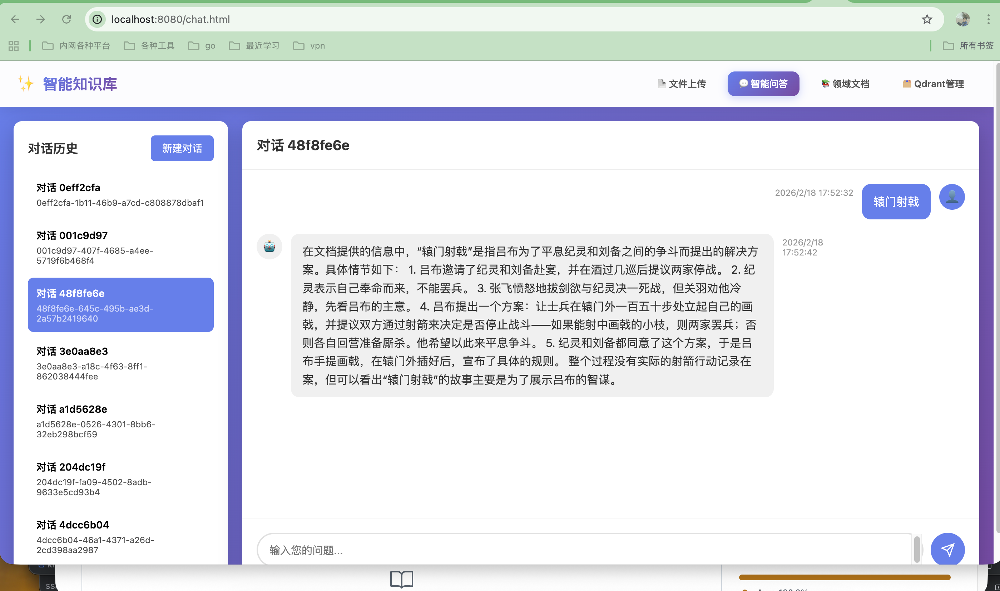

# ✨ 智能知识库系统

<div align="center">

基于 **Spring Boot 4** + **LangChain4j** + **Ollama** + **Qdrant** 的企业级 RAG（检索增强生成）知识库问答系统

[](https://openjdk.org/)
[](https://spring.io/projects/spring-boot)
[](https://docs.langchain4j.dev/)
[](LICENSE)

</div>

---

## 📋 目录

- [功能特性](#-功能特性)
- [技术架构](#-技术架构)
- [快速开始](#-快速开始)
- [功能详解](#-功能详解)
- [API 接口](#-api-接口)
- [配置说明](#-配置说明)
- [项目结构](#-项目结构)
- [常见问题](#-常见问题)

---

## 🎯 功能特性

### 核心功能

- 📄 **文档上传** - 支持 PDF/TXT，智能分块
- 🧠 **智能问答** - RAG检索增强，流式响应
- **智能体对话** ⭐ - 多智能体协作，工具调用，金融计算
- 📚 **领域文档管理** - 10+领域，异步处理
- 🗂️ **Qdrant管理** - 集合管理，自动创建
- 💾 **数据持久化** - SQLite + Qdrant
- 🎨 **现代化UI** - 统一渐变设计，毛玻璃效果

### 智能体功能

- 🔢 **数学计算** - 使用 exp4j 精确计算
- 📊 **金融计算** - IRR、债券定价、期权定价（Black-Scholes）
- 📎 **文件分析** - MCP文件系统，支持上传文件并分析 ⭐
- 🌤️ **天气查询** - 实时天气信息
- 🕐 **时间查询** - 当前日期时间
- 🔍 **向量检索** - 知识库智能搜索
- 💬 **通用对话** - 自然语言交互

---

## 🖼️ 界面预览

### 智能问答界面



### 领域文档管理


### Qdrant 管理界面


---

## 🚀 快速开始

### 前置要求

- Java 21+
- Maven 3.9+
- Ollama
- Qdrant

### 安装运行

```bash
# 1. 启动 Ollama 并拉取模型
ollama serve
ollama pull qwen2.5:7b
ollama pull qwen3-embedding:0.6b

# 2. 启动 Qdrant
docker run -d -p 6333:6333 -p 6334:6334 qdrant/qdrant

# 3. 运行应用
mvn spring-boot:run

# 4. 访问系统
open http://localhost:8080
```

---

## 🔌 API 接口

### 领域文档上传

```bash
curl -X POST http://localhost:8080/api/domain/upload \
  -H "Content-Type: application/json" \
  -d '{
    "domain": "TECHNOLOGY",
    "title": "AI基础",
    "content": "..."
  }'
```

### 智能问答（流式）

```bash
curl -X POST http://localhost:8080/api/chat/stream \
  -H "Content-Type: application/json" \
  -d '{"question": "什么是AI？"}'
```

### 智能体对话（流式）

```bash
curl -X POST http://localhost:8080/api/agent-chat/stream \
  -H "Content-Type: application/json" \
  -d '{
    "message": "计算1+1等于多少",
    "enableVectorStore": true,
    "enableMcp": false,
    "enableTools": true
  }'
```

### 文件上传（MCP文件系统）⭐

```bash
# 上传文件
curl -X POST http://localhost:8080/api/agent-files/upload \
  -F "file=@document.txt" \
  -F "conversationId=optional-conversation-id"

# 获取已上传文件列表
curl http://localhost:8080/api/agent-files/files/{conversationId}

# 读取文件内容
curl http://localhost:8080/api/agent-files/files/{conversationId}/{fileName}
```

### 删除对话

```bash
curl -X DELETE http://localhost:8080/api/agent-chat/conversations/{conversationId}
```

---

## ⚙️ 配置说明

### application.yaml 关键配置

```yaml
ollama:
  base-url: http://localhost:11434
  chat-model: qwen2.5:7b
  embedding-model: qwen3-embedding:0.6b

qdrant:
  vector-size: 1024
  create-collection-if-not-exists: true

rag:
  chunk-size: 500
  max-results: 5
  min-score: 0.5

# Agent 配置
agent:
  context-window-size: 10  # 对话历史窗口大小
  vector-store-enabled: true
  vector-max-results: 3
  vector-min-score: 0.3
  mcp-allowed-directory: .  # MCP文件系统允许访问的目录 ⭐
```

---

## 📁 项目结构

```
src/main/java/com/mark/knowledge/
├── KnowledgeApplication.java
├── agent/             # 智能体模块
│   ├── config/        # Agent 配置
│   ├── controller/    # Agent 控制器
│   │   ├── AgentFileController.java      # 文件上传控制器 ⭐
│   │   └── AgentOrchestrationController.java  # Agent 编排控制器
│   ├── dto/           # 数据传输对象
│   └── service/       # Agent 服务
│       ├── IntelligentAgentRouter.java    # 智能路由
│       ├── McpFileService.java            # MCP文件系统服务 ⭐
│       ├── ToolAgent.java                 # 工具 Agent
│       ├── ToolExecutor.java              # 工具执行器
│       ├── FinancialCalculationService.java    # 金融计算
│       ├── BondCalculationService.java         # 债券计算
│       ├── OptionCalculationService.java       # 期权计算
│       └── FinancialToolAgent.java             # 金融工具 Agent
├── chat/              # 聊天模块
│   ├── controller/    # 聊天控制器
│   ├── dto/           # DTO
│   ├── entity/        # 实体
│   ├── repository/    # Repository
│   └── service/       # 聊天服务
├── rag/               # RAG模块
│   ├── app/          # 控制器
│   ├── config/       # 配置
│   ├── dto/          # DTO
│   ├── entity/       # 实体
│   ├── repository/   # Repository
│   └── service/      # 服务
└── config/           # 全局配置

src/main/resources/
├── static/           # 静态资源
│   ├── images/       # 图片资源
│   ├── upload.html   # 文件上传页面
│   ├── chat.html     # 智能问答页面
│   ├── agent-chat.html  # 智能体对话页面 ⭐
│   ├── domain.html   # 领域文档页面
│   └── qdrant.html   # Qdrant 管理页面
└── application.yaml  # 配置文件

docs/                 # 文档目录
├── Financial-Calculation-Guide.md  # 金融计算指南
└── Financial-Summary.md             # 金融计算总结
```

---

## 🎨 功能界面

- 📄 **upload.html** - 文件上传
- 💬 **chat.html** - 智能问答
- **agent-chat.html** - 智能体对话 ⭐
  - 消息附件功能 - 上传文件并分析
  - 对话历史管理 - 删除对话记录
  - 优化的确认对话框 - 精美的交互体验
- 📚 **domain.html** - 领域文档
- 🗂️ **qdrant.html** - Qdrant管理

---

## 💡 金融计算功能

### 支持的计算类型

1. **投资分析**
   - IRR（内部收益率）- 使用牛顿迭代法
   - NPV（净现值）
   - 摊销计划 - 贷款/抵押还款计划

2. **债券计算**
   - 债券定价
   - YTM（到期收益率）
   - Macaulay 久期
   - 修正久期
   - 凸度

3. **期权计算**
   - Black-Scholes 期权定价
   - Delta、Gamma、Vega、Theta、Rho
   - 隐含波动率

详细文档请参考：
- [金融计算指南](docs/Financial-Calculation-Guide.md)
- [金融计算总结](docs/Financial-Summary.md)

---

## 💡 MCP文件系统功能 ⭐

### 功能特性

- 📎 **消息附件** - 在智能体对话中上传文件
- 🔍 **文件读取** - LLM使用MCP工具读取上传的文件
- 📝 **文件分析** - 结合知识库内容分析上传的文件
- 🗂️ **智能路径** - 自动提取相对路径，确保LLM正确访问文件

### MCP工具列表

1. **readFile** - 读取文件内容（支持预览）
2. **listDirectory** - 列出目录内容
3. **searchFiles** - 搜索文件（按文件名和内容）
4. **getFileInfo** - 获取文件详细信息

### 使用示例

```
用户：上传信访相关文件
系统：文件上传到 uploads/general/信访政策.txt

用户：这里面的做法是不是符合信访的政策？
LLM：
1. 使用 readFile 读取 uploads/general/信访政策.txt
2. 使用向量检索查询知识库中的信访政策
3. 对比分析并回答：文件内容是否符合政策要求
```

### 安全特性

- ✅ 路径限制 - 只能访问指定目录
- ✅ 路径解析 - 防止目录遍历攻击
- ✅ 文件大小限制 - 大文件自动截断预览
- ✅ 对话隔离 - 文件按对话ID组织存储

---

## 示例

文件上传上传了三国演义里面部分用来测试，见：`/resources/三国演义34章.txt`，可以用来本地测试。

---

## ❓ 常见问题

### Q: 如何切换到其他 LLM 模型？

A: 修改 `application.yaml` 中的配置：
```yaml
ollama:
  chat-model: your-model-name
```

### Q: 如何调整对话历史窗口大小？

A: 修改 `application.yaml`：
```yaml
agent:
  context-window-size: 20  # 改为 20 条历史
```

### Q: 金融计算支持哪些功能？

A: 支持 IRR、NPV、债券定价、期权定价（Black-Scholes）、摊销计划等，详见金融计算文档。

### Q: 如何使用文件上传功能？⭐

A: 在智能体对话页面：
1. 点击输入框左侧的📎按钮
2. 选择要上传的文件（.txt, .pdf, .md, .doc, .docx）
3. 文件会显示在附件预览区
4. 输入问题，如"请分析这个文件"
5. 发送后，LLM会自动读取文件并回答

### Q: 上传的文件保存在哪里？

A: 文件保存在 `uploads/{conversationId}/` 目录下，按照对话ID组织存储，便于管理和隔离。

### Q: MCP文件系统有什么安全措施？

A:
- 路径限制：只能访问配置的目录
- 路径解析验证：防止目录遍历攻击
- 相对路径处理：自动提取正确的相对路径
- 对话隔离：不同对话的文件分开存储

---

<div align="center">

**如果这个项目对你有帮助，请给一个 ⭐️**

</div>
