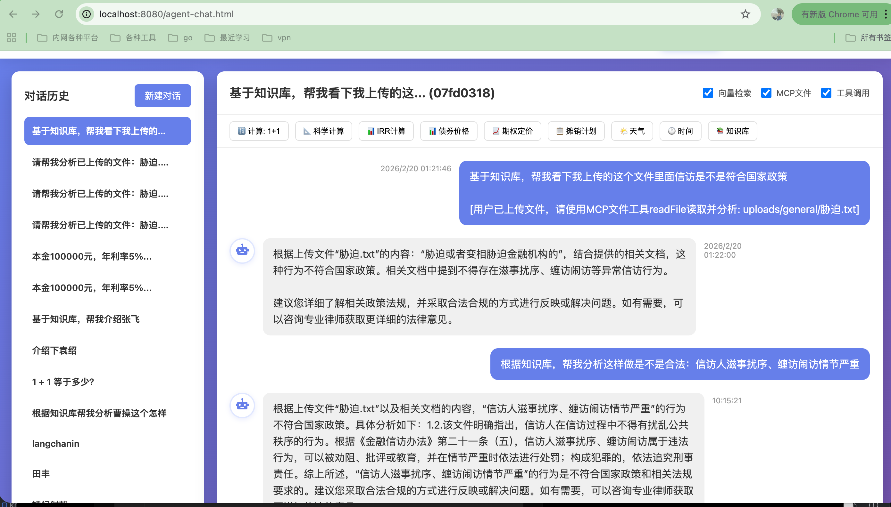
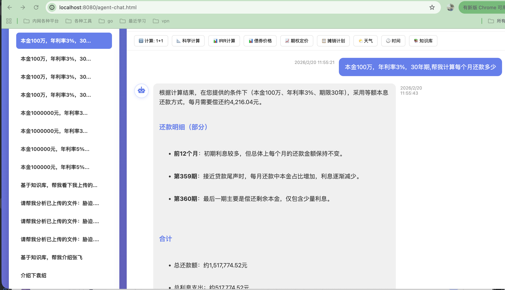
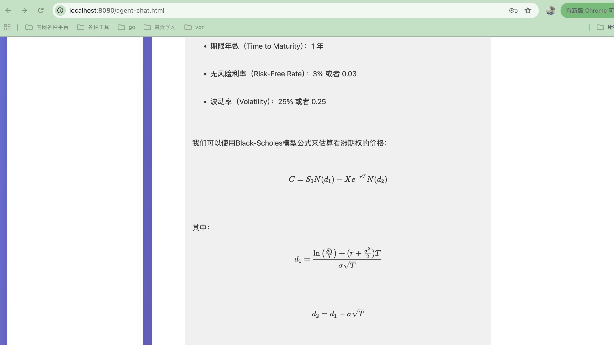

# ✨ 智能知识库系统

<div align="center">

基于 **Spring Boot 4** + **LangChain4j** + **Ollama** + **Qdrant** 的企业级 RAG（检索增强生成）知识库问答系统

[](https://openjdk.org/)
[](https://spring.io/projects/spring-boot)
[](https://docs.langchain4j.dev/)
[](LICENSE)

</div>

---

## 📋 目录

- [功能特性](#-功能特性)
- [快速开始](#-快速开始)
- [功能界面](#-功能界面)
- [API 接口](#-api-接口)
- [配置说明](#-配置说明)
- [数据库结构](#-数据库结构)
- [项目结构](#-项目结构)
- [核心功能详解](#-核心功能详解)
- [常见问题](#-常见问题)
- [更多文档](#-更多文档)

---

## 🎯 功能特性

### 核心功能

- 📄 **文档上传** - 支持 PDF/TXT，智能分块
- 🧠 **智能问答** - RAG检索增强，流式响应
- 🤖 **智能体对话** - LangChain4j Agentic架构，工具自主调用
- 📚 **领域文档管理** - 10+领域，异步处理
- 🗂️ **Qdrant管理** - 集合管理，自动创建
- 💾 **数据持久化** - SQLite + Qdrant
- 🎨 **现代化UI** - 统一渐变设计，毛玻璃效果
- 🌐 **混合模型** - 本地+云端智能路由

### 智能体工具

- 🔢 **数学计算** - exp4j精确计算
- 📊 **金融计算** - IRR、债券、期权（Black-Scholes）
- 📎 **文件分析** - MCP文件系统，上传文件并分析
- 🌤️ **天气查询** - 实时天气
- 🕐 **时间查询** - 当前日期时间
- 🔍 **向量检索** - 知识库智能搜索
- 💬 **上下文记忆** - 滑动窗口对话历史

---

## 🖼️ 界面预览

### 智能问答界面


### 领域文档管理


### Qdrant 管理界面


### 智能体对话界面

#### 1. 文件分析 + 知识库检索



#### 2. 金融计算 - 贷款利息



#### 3. 金融计算 - 期权定价



---

## 🚀 快速开始

### 前置要求

- Java 21+
- Maven 3.9+
- Ollama
- Qdrant
- 阿里云DashScope API Key（可选，用于混合模型）

### 安装运行

```bash
# 1. 启动 Ollama 并拉取模型
ollama serve
ollama pull qwen2.5:7b
ollama pull qwen3-embedding:0.6b

# 2. 启动 Qdrant
docker run -d -p 6333:6333 -p 6334:6334 qdrant/qdrant

# 3. 运行应用
mvn spring-boot:run

# 4. 访问系统
open http://localhost:8080
```

---

## 🎨 功能界面

| 页面 | 路径 | 功能 |
|------|------|------|
| 文件上传 | `/upload.html` | 上传PDF/TXT文档 |
| 智能问答 | `/chat.html` | RAG知识库问答 |
| **智能体对话** | `/agent-chat.html` | Agentic AI + 工具调用 |
| 领域文档 | `/domain.html` | 领域知识管理 |
| Qdrant管理 | `/qdrant.html` | 向量数据库管理 |

---

## 🔌 API 接口

### 1. 智能问答（流式）

```bash
curl -X POST http://localhost:8080/api/chat/stream \
  -H "Content-Type: application/json" \
  -d '{"question": "什么是AI？"}'
```

### 2. 智能体对话（流式）

```bash
curl -X POST http://localhost:8080/api/agent-chat/stream \
  -H "Content-Type: application/json" \
  -d '{
    "message": "计算1+1等于多少"
  }'
```

### 3. 文件上传

```bash
# 上传文件
curl -X POST http://localhost:8080/api/agent-files/upload \
  -F "file=@document.txt" \
  -F "conversationId=optional-conversation-id"

# 获取文件列表
curl http://localhost:8080/api/agent-files/files/{conversationId}

# 读取文件内容
curl http://localhost:8080/api/agent-files/files/{conversationId}/{fileName}
```

### 4. 对话管理

```bash
# 获取对话历史
curl http://localhost:8080/api/agent-chat/history/{conversationId}

# 获取所有会话
curl http://localhost:8080/api/agent-chat/conversations

# 删除会话
curl -X DELETE http://localhost:8080/api/agent-chat/conversations/{conversationId}
```

### 5. 领域文档上传

```bash
curl -X POST http://localhost:8080/api/domain/upload \
  -H "Content-Type: application/json" \
  -d '{
    "domain": "TECHNOLOGY",
    "title": "AI基础",
    "content": "..."
  }'
```

---

## ⚙️ 配置说明

### application.yaml 关键配置

```yaml
# Ollama 配置
ollama:
  base-url: http://localhost:11434
  chat-model: qwen2.5:7b
  embedding-model: qwen3-embedding:0.6b

# Qdrant 配置
qdrant:
  host: localhost
  port: 6334
  collection-name: knowledge-base
  vector-size: 1024
  create-collection-if-not-exists: true

# RAG 配置
rag:
  chunk-size: 500
  chunk-overlap: 50
  max-results: 5
  min-score: 0.5

# Agent 配置
agent:
  context-window-size: 10      # 对话历史窗口大小
  vector-store-enabled: true   # 启用向量检索
  mcp-file-enabled: true       # 启用文件操作
  tool-call-enabled: true      # 启用工具调用
  mcp-allowed-directory: .     # MCP文件系统允许访问的目录

# 模型路由配置
model-router:
  strategy: PERCENTAGE         # PERCENTAGE 或 BUSINESS_TYPE
  percentage:
    aliyun: 0                  # 0% 使用阿里云（仅本地）
    local: 100                 # 100% 使用本地模型
```

---

## 🗄️ 数据库结构

系统使用 **SQLite** 作为关系型数据库，配合 **Qdrant** 向量数据库。

### 数据表

| 表名 | 说明 |
|------|------|
| `users` | 用户表 |
| `chat_messages` | 聊天消息表 |
| `domain_documents` | 领域文档表 |

**重要**：首次启动时，JPA 会自动创建表结构。详见 [数据库建表 SQL](docs/Database-Schema.md)。

### 数据库配置

```yaml
spring:
  datasource:
    url: jdbc:sqlite:knowledge.db
    driver-class-name: org.sqlite.JDBC
  jpa:
    database-platform: org.hibernate.community.dialect.SQLiteDialect
    hibernate:
      ddl-auto: update  # 自动创建/更新表结构
    show-sql: false
```

---

## 📁 项目结构

```
src/main/java/com/mark/knowledge/
├── KnowledgeApplication.java
├── agent/                          # 智能体模块
│   ├── controller/
│   │   ├── AgentFileController.java        # 文件上传控制器
│   │   └── AgentOrchestrationController.java # Agent 编排控制器
│   ├── dto/                      # 数据传输对象
│   ├── service/
│   │   ├── AgenticService.java            # 统一 Agentic 服务 ⭐
│   │   ├── McpFileService.java            # MCP 文件系统
│   │   ├── ToolAgent.java                 # 计算工具 Agent
│   │   ├── FinancialToolAgent.java        # 金融工具 Agent
│   │   ├── FinancialCalculationService.java  # 金融计算服务
│   │   ├── BondCalculationService.java       # 债券计算
│   │   └── OptionCalculationService.java     # 期权计算
│   └── tool/
│       └── VectorSearchTool.java           # 向量检索工具
├── chat/                           # 聊天模块
│   ├── controller/
│   ├── dto/
│   ├── entity/
│   ├── repository/
│   └── service/
│       ├── ChatService.java             # 聊天服务
│       ├── AuthService.java             # 认证服务
│       └── ModelRouterService.java      # 模型路由服务 ⭐
├── rag/                            # RAG 模块
│   ├── app/          # RAG 控制器
│   ├── config/       # RAG 配置
│   ├── dto/          # RAG DTO
│   ├── entity/       # RAG 实体
│   ├── repository/   # RAG Repository
│   └── service/      # RAG 服务
└── config/                        # 全局配置

src/main/resources/
├── static/                        # 静态资源
│   ├── images/
│   ├── upload.html
│   ├── chat.html
│   ├── agent-chat.html
│   ├── domain.html
│   └── qdrant.html
└── application.yaml

docs/                              # 文档目录
├── Financial-Calculation-Guide.md
├── Financial-Summary.md
├── LLM-Tool-Calling-Architecture.md
└── Mixed-Model-Architecture-Guide.md
```

---

## 💡 核心功能详解

### 1. Agentic AI 架构 ⭐

基于 LangChain4j 1.11.0 的 Agentic 模式：

- **自主工具调用** - Agent 根据用户问题自主决定调用哪些工具
- **上下文记忆** - MessageWindowChatMemory 滑动窗口管理对话历史
- **多工具协作** - 向量检索、文件分析、金融计算无缝协作
- **流式响应** - 实时流式输出，提升用户体验

**可用工具**：
1. `searchKnowledge` - 向量知识库检索
2. `readFile` - 读取上传的文件
3. `listDirectory` - 列出目录文件
4. `searchFiles` - 搜索文件内容
5. `calculate` - 数学计算
6. `calculateAmortization` - 贷款计算
7. `getCurrentTime` - 获取时间
8. `getWeather` - 查询天气

### 2. MCP 文件系统 ⭐

**功能特性**：
- 📎 消息附件 - 在对话中上传文件
- 🔍 文件读取 - LLM 使用工具读取文件
- 📝 文件分析 - 结合知识库分析上传文件
- 🗂️ 智能路径 - 自动提取相对路径

**安全特性**：
- ✅ 路径限制 - 只能访问指定目录
- ✅ 路径解析 - 防止目录遍历攻击
- ✅ 文件大小限制 - 大文件自动截断预览
- ✅ 对话隔离 - 按对话ID组织存储

**使用示例**：
```
用户：上传信访相关文件
系统：文件上传到 uploads/agent-xxx/信访政策.txt

用户：这里面的做法是不是符合信访的政策？
Agent：
1. 使用 readFile 读取文件
2. 使用 searchKnowledge 查询知识库
3. 对比分析并回答
```

### 3. 混合模型架构 ⭐

**支持的模型**：

| 模型 | 提供商 | 用途 |
|------|--------|------|
| qwen2.5:7b | Ollama（本地） | 快速响应、工具调用 |
| qwen-plus | 阿里云DashScope | 复杂推理、长上下文 |

**路由策略**：

1. **百分比路由** - 按比例分配请求
   ```yaml
   model-router:
     strategy: PERCENTAGE
     percentage:
       aliyun: 30  # 30% 使用阿里云
       local: 70   # 70% 使用本地
   ```

2. **业务类型路由** - 根据问题类型智能选择
   ```yaml
   model-router:
     strategy: BUSINESS_TYPE
     business-type:
       aliyun-types:
         - COMPLEX_QUERY    # 复杂查询
         - LONG_CONTEXT     # 长上下文
       local-types:
         - SIMPLE_QA        # 简单问答
         - TOOL_CALLING     # 工具调用
   ```

**重要**：向量嵌入模型固定使用本地 Ollama，不受路由影响。

### 4. 金融计算功能

**支持的计算**：

1. **投资分析** - IRR、NPV、摊销计划
2. **债券计算** - 定价、YTM、久期、凸度
3. **期权计算** - Black-Scholes、Greeks

详细文档：
- [金融计算指南](docs/Financial-Calculation-Guide.md)
- [金融计算总结](docs/Financial-Summary.md)

---

## ❓ 常见问题

### Q: 如何切换 LLM 模型？

A: 修改 `application.yaml`：
```yaml
ollama:
  chat-model: your-model-name
```

### Q: 如何调整对话历史窗口？

A: 修改配置：
```yaml
agent:
  context-window-size: 20  # 改为 20 条历史
```

### Q: 如何使用阿里云模型？

A: 配置环境变量和 API Key：
```bash
export DASHSCOPE_API_KEY=your-api-key
```

```yaml
dashscope:
  api-key: ${DASHSCOPE_API_KEY}

model-router:
  percentage:
    aliyun: 30  # 30% 请求使用阿里云
```

### Q: 上传的文件保存在哪里？

A: `uploads/{conversationId}/` 目录，按对话ID组织。

### Q: 如何选择路由策略？

A:
- **百分比路由** - 控制成本、负载均衡
- **业务类型路由** - 优化性能、智能选择

推荐：生产环境用业务类型路由，测试环境用百分比路由。

---

## 📚 更多文档

- [数据库建表 SQL](docs/Database-Schema.md) - 数据库表结构
- [金融计算指南](docs/Financial-Calculation-Guide.md) - 金融计算功能
- [金融计算总结](docs/Financial-Summary.md) - 金融计算总结
- [LLM Tool Calling 架构](docs/LLM-Tool-Calling-Architecture.md) - 工具调用架构
- [混合模型架构指南](docs/Mixed-Model-Architecture-Guide.md) - 混合模型配置

---

<div align="center">

**如果这个项目对你有帮助，请给一个 ⭐️**

</div>
