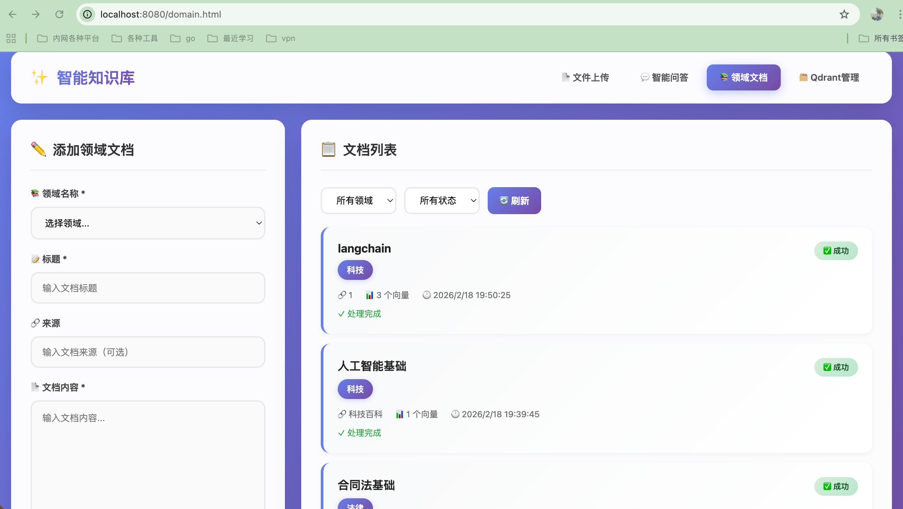
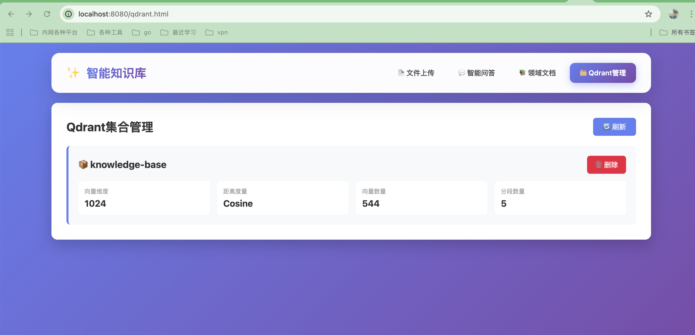

# ✨ 智能知识库系统

<div align="center">

基于 **SpringBoot 4** + **LangChain4j** + **Ollama** + **Qdrant** 的企业级 RAG（检索增强生成）知识库问答系统

[](https://openjdk.org/)
[](https://spring.io/projects/spring-boot)
[](https://docs.langchain4j.dev/)
[](LICENSE)

</div>

---

## 📋 目录

- [功能特性](#-功能特性)
- [技术架构](#-技术架构)
- [快速开始](#-快速开始)
- [功能详解](#-功能详解)
- [API 接口](#-api-接口)
- [配置说明](#-配置说明)
- [项目结构](#-项目结构)
- [常见问题](#-常见问题)

---

## 🎯 功能特性

### 核心功能

- 📄 **文档上传** - 支持 PDF/TXT，智能分块
- 🧠 **智能问答** - RAG检索增强，流式响应
- 📚 **领域文档管理** ⭐ - 10+领域，异步处理
- 🗂️ **Qdrant管理** - 集合管理，自动创建
- 💾 **数据持久化** - SQLite + Qdrant
- 🎨 **现代化UI** - 渐变设计，毛玻璃效果

---

## 🖼️ 界面预览

### 智能问答界面


### 领域文档管理



### Qdrant 管理界面



---

## 🚀 快速开始

### 前置要求

- Java 21+
- Maven 3.9+
- Ollama
- Qdrant

### 安装运行

```bash
# 1. 启动 Ollama 并拉取模型
ollama serve
ollama pull qwen2.5:7b
ollama pull qwen3-embedding:0.6b

# 2. 启动 Qdrant
docker run -d -p 6333:6333 -p 6334:6334 qdrant/qdrant

# 3. 运行应用
mvn spring-boot:run

# 4. 访问系统
open http://localhost:8080
```

---

## 🔌 API 接口

### 领域文档上传

```bash
curl -X POST http://localhost:8080/api/domain/upload \
  -H "Content-Type: application/json" \
  -d '{
    "domain": "TECHNOLOGY",
    "title": "AI基础",
    "content": "..."
  }'
```

### 智能问答（流式）

```bash
curl -X POST http://localhost:8080/api/chat/stream \
  -H "Content-Type: application/json" \
  -d '{"question": "什么是AI？"}'
```

---

## ⚙️ 配置说明

### application.yaml 关键配置

```yaml
ollama:
  base-url: http://localhost:11434
  chat-model: qwen2.5:7b
  embedding-model: qwen3-embedding:0.6b

qdrant:
  vector-size: 1024
  create-collection-if-not-exists: true

rag:
  chunk-size: 500
  max-results: 5
  min-score: 0.5
```

---

## 📁 项目结构

```
src/main/java/com/mark/knowledge/
├── KnowledgeApplication.java
├── chat/              # 聊天模块
├── rag/               # RAG模块
│   ├── app/          # 控制器
│   ├── config/       # 配置
│   ├── dto/          # DTO
│   ├── entity/       # 实体
│   ├── repository/   # Repository
│   └── service/      # 服务
└── config/           # 全局配置
```

---

## 🎨 功能界面

- 📄 upload.html - 文件上传
- 💬 chat.html - 智能问答
- 📚 domain.html - 领域文档
- 🗂️ qdrant.html - Qdrant管理

---
## 示例
文件上传上传了三国演义里面部分用来测试，见：/resources/三国演义34章.txt，可以用来本地测试。
## ❓ 常见问题

详见完整文档...

---

<div align="center">

**如果这个项目对你有帮助，请给一个 ⭐️**

</div>
